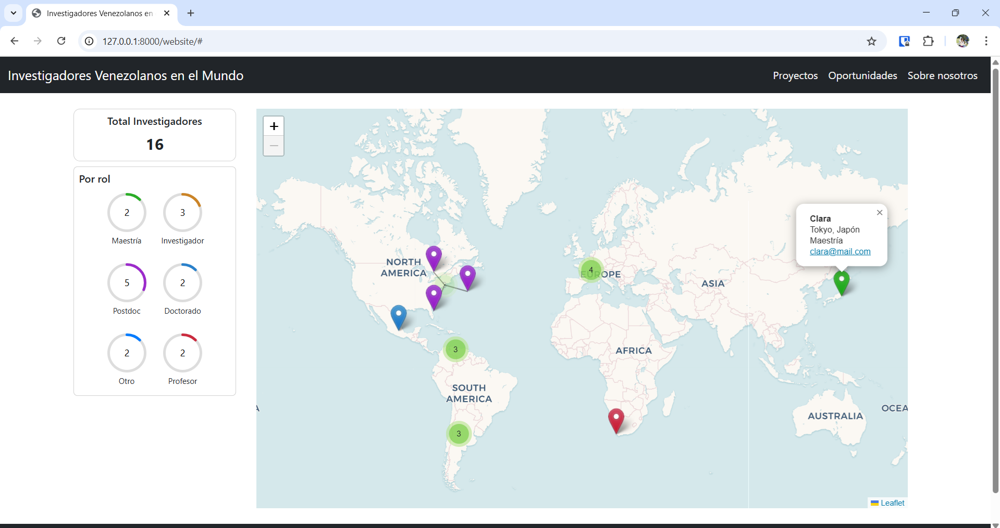
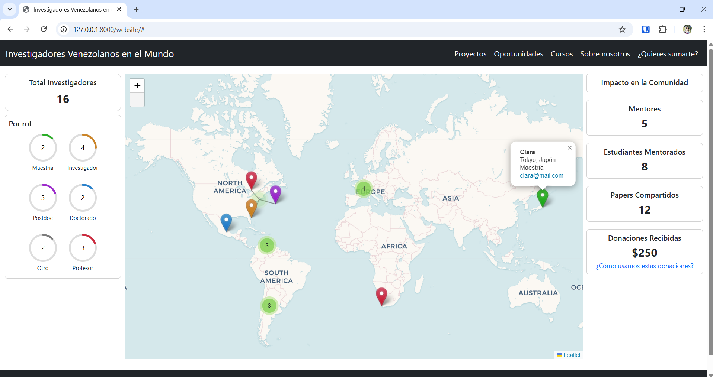

# Investigadores Venezolanos en el Mundo (Web App)
[Venezuelan Researchers Around the World (Web App)]

## Description
This web application is being developed on request for a third party, with the purpose of creating a connected network of Venezuelan researchers worldwide. The app displays researchers on an interactive map, allowing users to see where Venezuelan researchers are located and helps those planning to go abroad to connect with others who can guide them in finding opportunities.

**Note:** The data currently uploaded is dummy data; the researcher information is not real.

## Features
- Interactive world map showing locations of researchers.
- Categorization of researchers by role (e.g., Doctorado, Maestría, Postdoc, Profesor, Investigador, Otros).
- Metrics panel showing total number of researchers and distribution per role using animated circular indicators.
- Marker clustering for better visualization in areas with multiple researchers.
- Responsive design using Bootstrap for accessibility on different devices.
- Legend indicating roles with color-coded markers.

## Purpose
- Facilitate networking among Venezuelan researchers worldwide.
- Help Venezuelans planning to study abroad connect with researchers who can provide guidance and opportunities.

## Status
Project in progress. The app will be updated regularly with new features and improved functionality.

<div style="display: flex; gap: 20px; flex-wrap: wrap;">
  
  
</div>

## Data Preparation
The repository includes a Python script `dataPrep/DataPrep.py` that processes researcher data from CSV files and generates the JSON files used by the web application. This allows the app to dynamically visualize the data on the map.

The script prepares the input data for the web app. It reads researcher information from a CSV file containing:

- `name and last name`  
- `city and country`    
- `role`  
- `email`  

The script then calculates the geolocation (latitude and longitude) for each researcher, which is required for placing markers on the map. Finally, it outputs a JSON file used as the input for the web app.

**To use:**  
```bash
python dataPrep.py [CSV-file-name].csv
